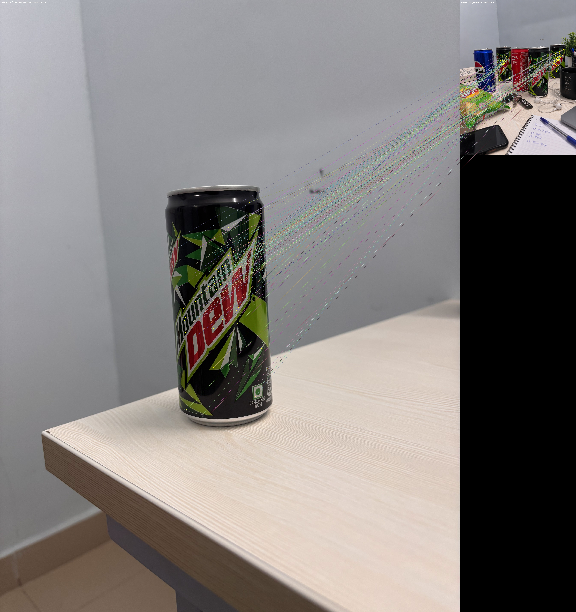
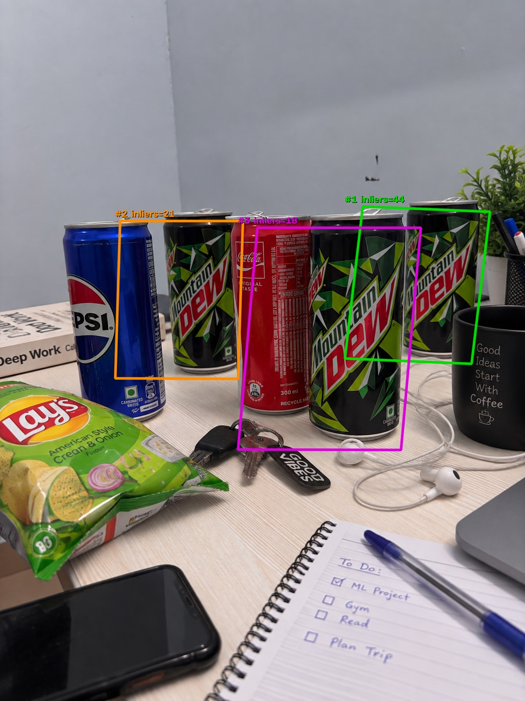

# Assignment 1 — Multi-Instance Object Recognition in Cluttered Scenes

---

## 1. Images Used

| Role | Description |
|------|-------------|
| **Template** | Single Mountain Dew can, isolated on a plain desk surface, captured at a rotated angle (~90°) |
| **Scene** | Cluttered hostel desk containing **3 Mountain Dew cans** as targets, plus distractors: 1 Pepsi can, 1 Coca-Cola can, Lay's chips packet, car keys, earphones, notebook, phone, pen holder with plant, and a coffee mug |

The pair satisfies all assignment challenges:
- **Rotation**: template is shot at ~90°; scene cans are upright at varying angles
- **Partial occlusion**: one Mountain Dew is partially hidden behind the Coca-Cola can
- **Scale variation**: cans at different depths appear at slightly different sizes
- **Heavy clutter**: notebook, keys, phone, chips packet create significant background noise

---

## 2. Pipeline Overview

```
Template + Scene images
        │
        ▼
   SIFT Extraction          (cv2.SIFT_create — OpenCV allowed)
        │
        ▼
  Tight Object Bounds       (from keypoint spread, not full image corners)
        │
        ▼
  Feature Matching          (from scratch — Euclidean dist + Lowe's ratio)
        │
        ▼
  ┌──────────────────────────────────────────┐
  │          Greedy Extraction Loop          │
  │                                          │
  │   4D Generalized Hough Transform         │
  │   (from scratch — parameter voting)      │
  │          ↓                               │
  │   RANSAC + Least-Squares Affine          │
  │   (from scratch — Ax = b solver)         │
  │          ↓                               │
  │   Geometric Validation                   │
  │   (det, SVD shear, area, centroid, diag) │
  │          ↓                               │
  │   Accept → remove inliers from pool      │
  │   Reject → remove bin from pool          │
  └──────────────────────────────────────────┘
        │
        ▼
  IoU Non-Maximum Suppression  (from scratch)
        │
        ▼
  Final Bounding Boxes
```

---

## 3. Step-by-Step Mathematical Implementation

### 3.1 SIFT Feature Extraction

Using `cv2.SIFT_create(nfeatures=3000)`, each keypoint carries:
- **Position** `kp.pt = (x, y)` in pixel coordinates
- **Scale** `kp.size` — diameter of the characteristic region
- **Orientation** `kp.angle ∈ [0°, 360°)` — dominant gradient direction
- **Descriptor** — 128-dimensional L2-normalised histogram vector

Results: **3,000** template keypoints, **3,001** scene keypoints.

---

### 3.2 Tight Template Object Bounds

Instead of using full image corners (which include the background desk/wall), we compute the bounding box of the SIFT keypoints themselves. Since keypoints cluster on the textured can body (not the plain background), their bounding box tightly wraps the object.

A 2nd–98th percentile filter removes any stray background keypoints:

```python
x1, x2 = np.percentile(pts[:, 0], [2, 98])
y1, y2 = np.percentile(pts[:, 1], [2, 98])
```

The resulting tight corners are projected into the scene — this is what makes the bounding boxes compact and fitted rather than covering the full photo frame. The keypoint centroid `(cx, cy)` also serves as the Hough voting reference point.

---

### 3.3 Feature Correspondence — Lowe's Ratio Test (From Scratch)

Matching direction: **scene → template**. Every scene keypoint independently votes for a candidate object location, enabling multi-instance discovery without any knowledge of how many instances exist.

**Distance computation** (no cv2 matchers, no sklearn):

$$\|a - b\|^2 = \|a\|^2 + \|b\|^2 - 2\,(a \cdot b)$$

Vectorised over the full `(N_{scene},\, M_{template})` matrix using NumPy, then `np.argpartition` to find the top-2 distances per row efficiently.

**Lowe's ratio test** — accept match only when:

$$\frac{d_1}{d_2} < 0.75$$

where `d1` is the distance to the best template match and `d2` to the second-best. Rejects ambiguous matches that look similar to multiple templates features (background noise).

Results: **258 matches** survived out of all raw pairings.

---

### 3.4 4D Generalized Hough Transform (From Scratch)

Standard RANSAC fails when the fraction of correct matches is very small (heavy occlusion). The Generalized Hough Transform lets each match vote independently for a consistent object hypothesis.

**Vote computation per match** `(scene kp s, template kp t)`:

The vector from the template keypoint toward the template center is:

$$\mathbf{d} = C_{template} - t.pt$$

Rotating by the relative orientation and scaling by the relative size maps this vector into scene coordinates, pointing from the scene keypoint toward the predicted object center:

$$\begin{pmatrix}d_x' \\ d_y'\end{pmatrix} = \sigma \cdot \begin{pmatrix}\cos\theta & -\sin\theta \\ \sin\theta & \cos\theta\end{pmatrix} \begin{pmatrix}d_x \\ d_y\end{pmatrix}$$

$$\hat{c} = s.pt + \mathbf{d}', \quad \sigma = \frac{s.size}{t.size}, \quad \theta = s.angle - t.angle$$

Each match casts one vote at 4D bin `(cx, cy, log₂σ, θ)`:

| Dimension | Bin size | Rationale |
|-----------|----------|-----------|
| Center X, Y | 50 px | Separates cans at different positions on the desk |
| log₂(scale) | 0.5 | Symmetric: 0.5× and 2× are equidistant from 1× |
| Angle | 45° | Coarse, since cans are roughly upright |

`round()` is used for binning so votes near a bin boundary are not split.

---

### 3.5 Greedy Extraction Loop

The Hough space is **rebuilt from scratch** at every iteration on the current active match pool. As inlier matches are removed after each detection, the dominant cluster shifts to the next instance naturally:

```
active_matches = all 258 matches

while len(active_matches) >= 3:
    hough = build_hough_space(active_matches, ...)  ← rebuilt each time
    best_bin = bin with most votes

    if best_bin votes < 3: stop

    run RANSAC on best_bin's matches

    if detection valid:
        remove ALL matches with reproj_err < threshold  ← inlier subtraction
    else:
        remove best_bin's matches  ← prevents infinite loop on bad clusters
```

---

### 3.6 RANSAC + Affine Estimation (From Scratch)

**Model**: 6-parameter 2D affine (handles rotation, scale, translation, and mild shear):

$$\begin{pmatrix}u \\ v\end{pmatrix} = \begin{pmatrix}a & b & t_x \\ c & d & t_y\end{pmatrix} \begin{pmatrix}x \\ y \\ 1\end{pmatrix}$$

**Least-squares solver** (`numpy.linalg.lstsq`, no cv2.findHomography): for `n` point pairs, build the linear system:

$$A\mathbf{x} = \mathbf{b}, \quad A \in \mathbb{R}^{2n \times 6}, \quad \mathbf{x} = [a,\,b,\,t_x,\,c,\,d,\,t_y]^T$$

**RANSAC loop** (2,000 iterations):
1. Sample 3 pairs; skip collinear samples (triangle area < 5 px²)
2. Solve affine; skip degenerate results
3. Count inliers: reprojection error `< 10 px`
4. Keep best model; refine by re-solving on all inliers

---

### 3.7 Geometric Validation (From Scratch)

Four checks on the affine matrix:

| Check | Criterion | Purpose |
|-------|-----------|---------|
| Min inliers | `n ≥ 4` | Requires genuine evidence |
| Determinant | `0.005 ≤ \|det\| ≤ 25` | Rejects collapsed or absurdly scaled transforms |
| SVD shear | `σ₁/σ₂ ≤ 4.0` | Rejects transforms that squash the object |
| Reprojection | `mean err ≤ 15 px` | Rejects geometrically inconsistent fits |

Four checks on the projected corners (Shoelace formula for area):

| Check | Criterion | Purpose |
|-------|-----------|---------|
| Corner containment | ≥ 3 of 4 within scene + 15% margin | Rejects wildly off-screen boxes |
| Area ratio | Shoelace area / template area ∈ [0.02, 4.0] | Rejects phantom tiny or enormous boxes |
| Centroid inside scene | `0 ≤ cx < w`, `0 ≤ cy < h` | Rejects off-screen centroids |
| Diagonal bound | Bbox diagonal < scene diagonal | Rejects absurdly large boxes |

---

### 3.8 IoU Non-Maximum Suppression (From Scratch)

$$\text{IoU}(A, B) = \frac{|A \cap B|}{|A \cup B|}$$

Detections sorted by inlier count. Any detection overlapping a kept one by `IoU > 0.3` is suppressed. Prevents double-counting the same physical can.

---

## 4. Results

### Naive Match (Baseline)

258 raw matches after Lowe's test drawn as coloured lines (template left, scene right):



- Lines scatter across all three Mountain Dew cans (correct targets) as well as the table surface, demonstrating SIFT's scale/rotation invariance
- Lines also land on the Pepsi can, Lay's packet, and notebook (background noise)
- No structure is visible — impossible to localise instances from this view alone

### Final Detection



| Instance | Colour | Inliers | Mean Reproj. Error | Description |
|----------|--------|---------|-------------------|-------------|
| #1 | Green | 44 | 0.83 px | Rightmost Mountain Dew (clear, front-facing) |
| #2 | Orange | 21 | 1.41 px | Leftmost Mountain Dew (slight occlusion by Pepsi) |
| #3 | Magenta | 18 | 0.86 px | Centre Mountain Dew (partially behind Coca-Cola) |

**All 3 Mountain Dew instances detected.** Pepsi can, Coca-Cola can, Lay's packet, and all other clutter produced zero detections — the Hough + RANSAC + geometric validation pipeline successfully suppressed all false positives.

---

## 5. Key Design Decisions

| Decision | Reason |
|----------|--------|
| **Tight keypoint bounds** (not image corners) | Full corners include the plain desk/wall background, giving a box 3–4× too large; keypoint bounds map only the textured can body |
| **Scene → template matching** | Allows every scene keypoint to independently vote for an instance; template → scene would only vote once per template feature |
| **Hough before RANSAC** | With only ~258 matches across 3 instances and heavy clutter, RANSAC alone on all matches would rarely pick a correct 3-point sample |
| **Rebuild Hough each iteration** | After removing inliers from instance 1, the next dominant cluster naturally corresponds to instance 2 |
| **SVD shear check** | Determinant alone misses transforms that look valid in scale but heavily distort the bounding box |
| **Corner area + centroid validation** | Catches false positives that survive RANSAC with minimal inlier count but produce geometrically implausible boxes |

---

## 6. Limitations

- The template is captured at ~90° rotation relative to the scene cans; SIFT orientation handles this but reduces match count vs. a similarly-oriented template
- The Hough angle bin (45°) is coarse; a can at exactly 22° from a bin edge splits its votes
- IoU NMS uses axis-aligned bounding boxes (AABB), which can incorrectly overlap two rotated polygons that do not physically intersect
